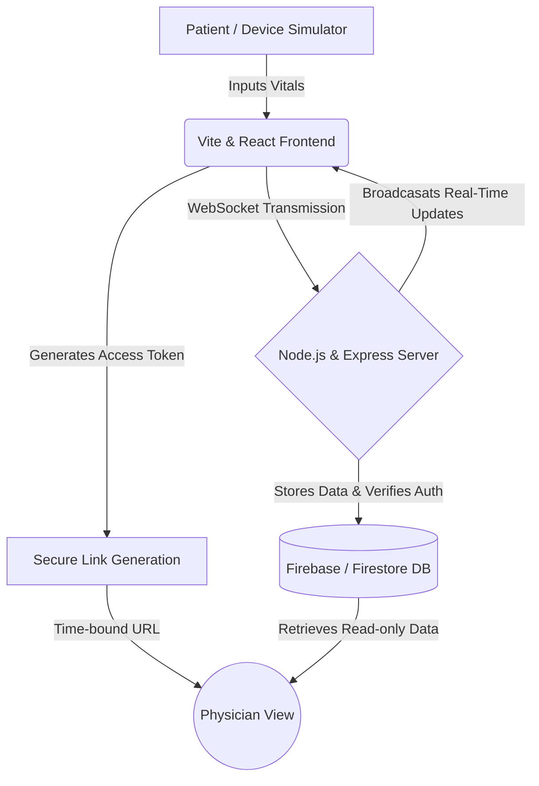

# Chapter 1: Introduction

## 1.1 Background of the Problem

Cardiovascular diseases (CVDs) remain the leading cause of mortality globally, representing a profound challenge to modern healthcare systems. Despite advancements in medical hardware, the systematic tracking of cardiovascular health outside of clinical environments remains largely disjointed. For patients suffering from hypertension, arrhythmia, or post-surgical recovery, continuous and accurate monitoring is essential to prevent life-threatening cardiovascular events. 

In the current landscape, the predominant practice relies heavily on episodic, manual tracking. Patients typically measure their own vitals—such as blood pressure and pulse—using home devices, manually record these figures in paper diaries, and present them to a physician weeks or months later during routine appointments. This analog approach leads to highly fragmented medical records. Physicians are thus forced to make clinical decisions based on isolated snapshots rather than continuous historical trends. 

 
*Figure 1.1: The traditional, disorganized method of tracking physiological data on paper logs lacks real-time insight.*

## 1.2 Motivation

The primary motivation behind this project is to eliminate the latency between a physiological crisis and medical intervention. In a fast-paced digital era where intelligent connectivity transforms industries, healthcare data remains notoriously siloed. 

Consider a real-life scenario: A 65-year-old patient named Thomas experiences a sudden, severe spike in blood pressure (180/110 mmHg) while resting at home on a Sunday. With a traditional paper log, Thomas simply writes the number down, perhaps intending to call his doctor the next day, completely unaware that he is at immediate risk of a stroke. The motivation for **Cardio-Sense** is to prevent such dangerous delays by introducing an active, real-time alert system that instantly identifies critical thresholds and bridges the communication gap between the patient and their physician seamlessly.

## 1.3 Need for Innovation

While home blood pressure monitors have become highly accurate, they function solely as isolated hardware. They lack an underlying ecosystem to transmit, securely store, or intelligently analyze the gathered data. There is a critical, unmet need for software innovation that connects these hardware endpoints to a centralized, analytical health dashboard. Current software solutions often require complicated patient portals or lack real-time synchronization capabilities.

### Existing Systems vs. Cardio-Sense

| Parameter | Existing Systems (Traditional Logging / Basic Apps) | Cardio-Sense (Proposed Innovation) |
| :--- | :--- | :--- |
| **Data Collection** | Manual entry, prone to human error | Real-time, instant digital synchronization |
| **Data Analysis** | Static numbers without context | Intelligent AI-driven categorization & trend analysis |
| **Alert Mechanism** | None; passive tracking only | Active, real-time intelligent alerts for anomalies |
| **Physician Access** | Physical papers or insecure emails | Secure, time-bound remote access tokens |
| **Speed & Efficiency** | Highly delayed communication | Instantaneous updates to the central dashboard |

## 1.4 Problem Statement

The traditional method of tracking cardiovascular vitals is dangerously passive, leading to isolated data, delayed clinical reactions, and immense friction in sharing medical records. There is a critical lack of a smart ecosystem capable of centralizing this data. **Cardio-Sense** aims to solve this by developing a real-time, intelligent cardiovascular monitoring web application that actively analyzes physiological data and facilitates seamless, secure data sharing between patients and healthcare providers.

*Figure 1.2: A secure, digitized ecosystem empowers patients and healthcare providers by providing actionable, visual data trends.*

## 1.5 Objectives of the Project

To realize the vision of Cardio-Sense, the following specific objectives have been formulated:
- **Develop** a responsive, real-time web dashboard using modern web technologies (React, Node.js) for continuous tracking of cardiovascular vitals.
- **Design** an intelligent categorization algorithm to automatically classify physiological readings and trigger instant alerts for abnormal spikes or drops.
- **Implement** a robust backend infrastructure (utilizing Socket.IO and Firebase) to ensure sub-second data synchronization seamlessly without page reloads.
- **Develop** a highly secure, time-expiring "Physician Access Link" system allowing doctors to easily view patient data remotely without cumbersome setups.
- **Design** dynamic historical data visualization charts to assist physicians in identifying long-term cardiovascular trends accurately.
- **Analyze** and ensure the secure integration of data authentication to strictly protect sensitive patient health information in compliance with standard security protocols.

## 1.6 Scope and Limitations

### Scope
The scope of **Cardio-Sense** encompasses the development of a full-stack web application designed for both patient oversight and physician review. It includes:
- Real-time physiological data intake (Systolic BP, Diastolic BP, and Pulse Rate).
- Data visualization modules mapping daily, weekly, and monthly health trends.
- A secure Google-based authentication framework.
- Generation of shareable access tokens for remote medical consultation.
- Export functionality for physical reporting (PDF/Spreadsheets).

### Limitations
While the system is robust, it faces specific constraints:
- **Hardware Integration Constraints:** The current iteration focuses on the software ecosystem and data simulation/input, bypassing direct native Bluetooth pairing with physical medical IoT devices due to browser hardware API limitations.
- **Diagnostic Boundaries:** The application provides intelligent analytics and categorizations but is not certified to provide final automated clinical diagnoses without a human physician's oversight.
- **Internet Dependency:** As a cloud-hosted web application reliant on Firebase and WebSockets, a stable internet connection is strictly required for the real-time alerting mechanics to function reliably.

## System Architecture

To understand how Cardio-Sense fulfills its objectives, the following architectural flow outlines the synchronous movement of data from the patient to the physician.

*Figure 1.3: The event-driven full-stack architecture of Cardio-Sense ensuring real-time capabilities.*
